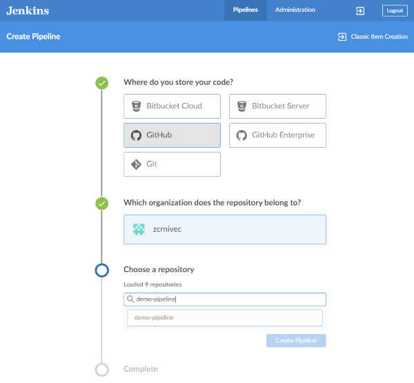
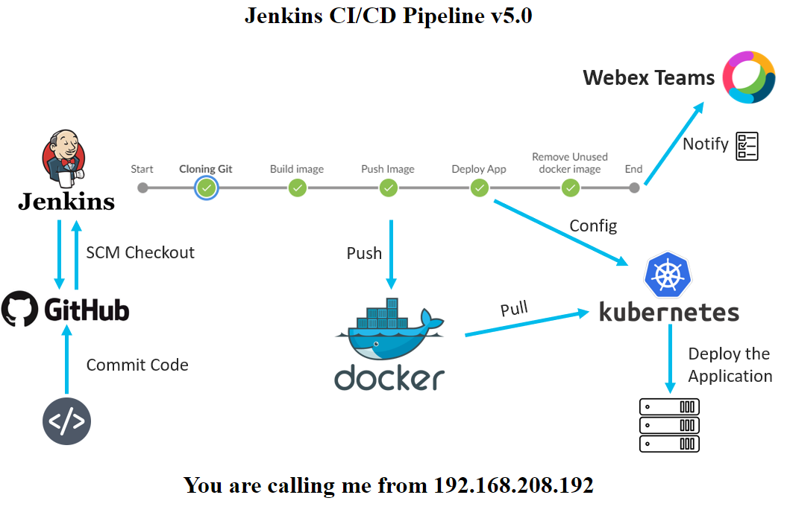

# Demo Pipeline

The project is designed to provide a starting point in setting up CI/CI pipeline with [Jenkins](https://www.jenkins.io/) and demonstrate integration with Cisco Webex Teams Bot. The system is ready for Kubernetes deployment

## Demo Pipeline License

This license is free, enables our customers and partners to do everything they need to do with the code, but also provides Cisco the limitations and protections we need in order to keep the policy and process requirements for sample code sharing as lightweight and streamlined as possible.

<!-- ToC -->
## Table of Contents  
- [Installation on Kubernetes](#installation-on-kubernetes)
    - [Jenkins Setup](#jenkins-setup)
    - [Sample App](#sample-app)
- [Summary](#summary)
<!-- ToC -->

# Installation on Kubernetes

The K8 cluster is deployed using Cisco Container Platform (CCP). In order to showcase, the demo there are few prerequisites that have to be configured.

## Jenkins Setup

We have opted for Jenkins as our CI server. The Jenkins itself is deployed on the same k8 cluster as the sample-app. We have build our own Docker image for Jenkins, so that we could pre-install Python3, Docker, Jenkins Plugins, and Kubectl.

#### Repositories:
- Docker repository: https://hub.docker.com/r/zcrnivec/modified-jenkins/
- Github repository: https://github.com/zcrnivec/modified-jenkins

**NOTE**: Github repository also contains the deployment and service .yaml files for k8.

To deploy Jenkins on Kubernetes cluster use the following commands:
```shell
kubectl apply -f jenkins-deployment.yaml
kubectl apply -f jenkins-service.yaml
```

Now that we have deployed the Jenkins, we have to add certain credentials into the credential repository inside Jenkins:

- WEBEX_TEAMS_ACCESS_TOKEN
- WEBEX_TEAMS_ROOM_ID
- JENKINS_TOKEN
- dockerhub (username/password)
- kubeconfig (.yaml file)

After you have added the necessary credentials, the deployment is almost done. The next step is to open Blue Ocean plugin and follow the steps to add the CI/CD pipeline.



## Sample App
Use the following command to find out the IP:PORT of sample application:
```shell
kubectl get services -o wide
```
After we access the application via browser we are met with the following:




## Summary

Now that everything is up and ready, the Jenkins will continuously check the repository every minute for any changes (new commits). Jenkins will trigger a CI/CD pipeline if there is a new commit.
